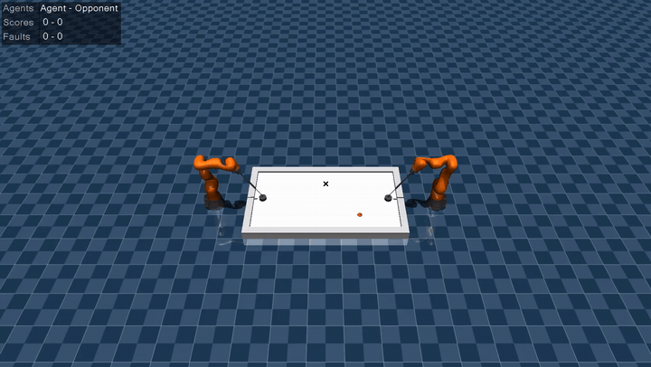

# Air-hockey memory distillation

This repository contains the software and experiment definitions for
**Distilling Recurrent World-Model Policies for Robot Air Hockey under
Tracking Loss**.

<p align="center">
  <a href="docs/assets/upstream-self-play-2023.mp4?raw=1">
    
  </a>
</p>

<p align="center">
  <sub>Reproduced upstream 2023 DreamerV3 self-play demo on Marvin. The inline preview loops; open it for the full-quality 13-second MP4.</sub>
</p>

The project studies whether a DreamerV3 defence policy can be distilled into
a compact recurrent policy whose memory has diagonal linear dynamics and only
`k = 0, 1, 2, or 4` nonlinear innovation channels. The core task is a
controlled incoming shot with a single temporary loss of puck tracking.

## Repository boundary

This repository contains code, configuration, tests, provenance records,
result schemas and figure/table generation. The LaTeX paper is maintained in a
separate Git repository. The parent project directory is only an unversioned
umbrella containing links to the two repositories and the private project
brief.

Large datasets, checkpoints and raw run directories must not be added to Git.
Store them in an appropriate artefact location and version their hashes and
retrieval instructions here. Small curated GitHub media may live under
`docs/assets/`; its source and hashes are recorded there.

## Execution environment

Development files may be edited locally, but code and experiments are run on
the `marvin` Linux box. Marvin's checkout and artefact paths, accelerator
details, container digest and upstream reproduction are recorded in
[`docs/marvin.md`](docs/marvin.md) and
[`docs/upstream_audit.md`](docs/upstream_audit.md). A shorter operational guide
is in [`docs/air_hockey_marvin.md`](docs/air_hockey_marvin.md).

The code repository is published at
[`unswei/airhockey-distillation`](https://github.com/unswei/airhockey-distillation).
No deployment path is configured.

## Planned layout

```text
configs/                 Versioned environment and experiment definitions
src/airhockey_distill/   Environment, teacher, student and evaluation code
scripts/                 Reproduction and Marvin execution entry points
tests/                   Unit and integration tests
docs/                    Upstream and execution-environment audits
results/                 Result schema and retrieval metadata only
artifacts/                Generated paper figures/tables (ignored by Git)
STATUS.md                 Commands, results, decisions and blockers
UPSTREAM.md               Dependency commits and licence obligations
```

The upstream audit and minimal direct-launch task slice are complete. The
slice has one deterministic shot and blackout, the 19-dimensional public
observation, the two-dimensional action adapter, deterministic replay and
three task-validity controls; see
[`docs/minimal_task_slice.md`](docs/minimal_task_slice.md). The pre-training
gate now returns `GO`; see
[`docs/teacher_training_gate.md`](docs/teacher_training_gate.md). The preserved
balanced v1 manifest records the initial failed task calibration, while the
corrected 216-shot
[`direct_launch_v2`](docs/direct_launch_distribution_v2.md) is the current
default. Inactive and fixed-centre each concede 92.6% of v2, and the privileged
controller saves 100%. The bounded
[`DreamerV3 smoke test`](docs/teacher_smoke_test.md) also passes on Marvin,
including CUDA compilation and 108 optimiser updates. The versioned
[`teacher reward`](docs/teacher_reward.md) produces concession, contact and
save returns in the same training path. The first
[`short learning diagnostic`](docs/teacher_learning_diagnostic.md) completed
20,000 requested steps but did not improve held-out save rate. The main
fault was an optimisation budget that ended before Dreamer's optimiser
completed warm-up. The
[`corrected training procedure`](docs/teacher_training_procedure.md) improves
held-out return and concession rate in a matched 20,000-step check, preserves
exact step checkpoints, and produced a validation-selected teacher at step
720,000. The first
[`Stage B memory validation`](docs/stage_b_memory_validation.md) returned
`NO_GO` on the earlier task because its predeclared effect sizes were too
small. The
[`observation-aliased v3 task`](docs/direct_launch_distribution_v3.md) then
passed its physical, aliasing and control gates, and a fresh v3 teacher saved
98.9% across its readiness evaluation. The
[`Stage B v2 comparison`](docs/stage_b_memory_validation_v2.md) remained
inconclusive because its imitation-trained feed-forward policy was too weak
without blackout. The separately predeclared
[`visible-baseline correction`](docs/stage_b_visible_baseline_v3.md) therefore
trained three strictly memoryless PPO policies directly on task reward and
selected seed 14304 using only no-blackout validation shots.

The held-out
[`Stage B v3 comparison`](docs/stage_b_memory_validation_v3.md) is now
complete and returns `GO`. On the untouched test split, the selected
feed-forward policy saved 90.7% without blackout and 33.3% at 20 steps; the
teacher saved 99.6% and 96.9%. The paired teacher advantage grew from 8.9 to
63.6 percentage points, with a 20-step bootstrap 95% interval of
[56.9, 70.2]. All five predeclared checks passed. This supports a memory
requirement in the controlled `direct_launch_v3` task and authorises the
principal recurrent-student work.

The follow-up
[`causal recurrent-state ablation`](docs/causal_memory_ablation.md) also
returns `GO`. Under deterministic inference, resetting the teacher state at
blackout onset reduces its 20-step save rate from 96.0% to 50.2%, a paired
45.8-point drop with 95% interval [38.7, 52.9]. An independent normal-state
replay reproduces all 1,125 episode records exactly, and the no-blackout arms
are identical. This directly supports the role of carried recurrent state in
the teacher's blackout performance.

Phase 3 now has its first implemented policy: the
[`n=64, k=2 structured recurrent student`](docs/structured_student_n64_k2.md).
Its diagonal 64-value memory receives a rank-2 nonlinear innovation and the
previous requested public command. Matched NumPy and PyTorch implementations provide
deterministic evaluation, sequence training and exact checkpoint reload. The
architecture now passes its tiny-dataset overfit gate: a newly collected
deterministic-mean episode is fit to `7.46e-5` action MSE, and an independent
repeat produces the same checkpoint hash. This establishes the training and
export path, not full-data or closed-loop student quality. The first full-data
seed is predeclared at 20,000 newly collected deterministic-mean episodes with
an episode-level 80/10/10 split. That seed has now completed, but its paired
validation save rate is only 45.3%; it is evidence that the vertical slice
runs, not evidence of a successful distilled controller. A controlled
[`failure diagnostic`](docs/structured_student_failure_diagnostic.md) now
locates the main error in the loss-masked initial 16 steps. Teacher control
over only that prefix recovers 224/225 no-blackout saves after the student
takes over, while student rollouts move far outside the teacher-data history
distribution. Exact repeated deterministic trajectories do not have
conflicting targets. The declared all-valid-step correction improved the
no-blackout save rate to 67.1% but did not pass its 75% gate. One deterministic
shadow-teacher round then recovered 98.7% no-blackout saves with the same
`n=64`, `k=2` architecture and seed. After that gate passed, the frozen student
saved 98.4% over 1,125 paired episodes and 97.8% at 20 blackout steps. This is
the first successful full-data structured-student vertical slice.

The matched [`GRU-64 baseline`](docs/gru_student_n64.md) is now implemented as
NumPy and PyTorch runtimes. Its standard gate equations match
`torch.nn.GRUCell`, and its deterministic one-episode overfit gate returns
`GO` with exact checkpoint reload. This verifies the GRU engineering path; it
does not yet provide a full-data GRU comparison.
One full-data GRU engineering pilot is also complete on the current frozen
40,000-episode aggregate. It selected validation action MSE `0.04521` with
exact reload. Its staged closed-loop evaluation passed the 225-shot visible
gate at 99.1%, then saved 98.4% across 1,125 paired blackout episodes and
97.3% at 20 steps. This establishes strong behaviour for the checkpoint.
Because the aggregate's shadow half was collected under the structured `k=2`
student, it is not treated as a fair recurrent-family comparison.

The fair [`principal sweep`](docs/principal_sweep_v1.md) is now predeclared.
It trains feed-forward, finite-stack, structured `k=0,1,2,4` and GRU-64
students with five matched seeds and exactly 20,000 family-specific shadow
episodes per family. Validation stays paired on the existing 225 shots; a new
225-shot principal test remains closed until all 35 checkpoints, validation
evidence and efficiency measurements are frozen.
Its structured NumPy/PyTorch runtime is now rank-configurable for
`k=0,1,2,4`; the frozen successful `k=2` checkpoint remains bit-exact under
the refactor. The new ranks are implemented but untrained.
The predeclared [ten-step finite-stack baseline](docs/finite_stack_student_10.md)
is also implemented with matched NumPy/PyTorch execution and framework-neutral
checkpoint export. It is untrained.
The [principal sweep pipeline](docs/principal_sweep_v1.md#shared-executable-pipeline)
now trains, shadow-labels and evaluates all seven families through common
code. It enforces the hash-bound base data, equal complete-episode loss
weighting and paired shadow/validation schedules. No principal run has started.

## Scientific guardrails

- Every policy receives the same non-privileged public observation.
- No puck velocity, observation stack or hidden simulator state enters the
  principal teacher or recurrent students.
- Recurrent state and previous action reset only at episode boundaries.
- Final test seeds are never used for training or architecture selection.
- Raw data and results are immutable; plots and tables are derived by script.
- Experimental values and citations remain explicit TODOs until verified.

See [`STATUS.md`](STATUS.md) for the current state of the project.
